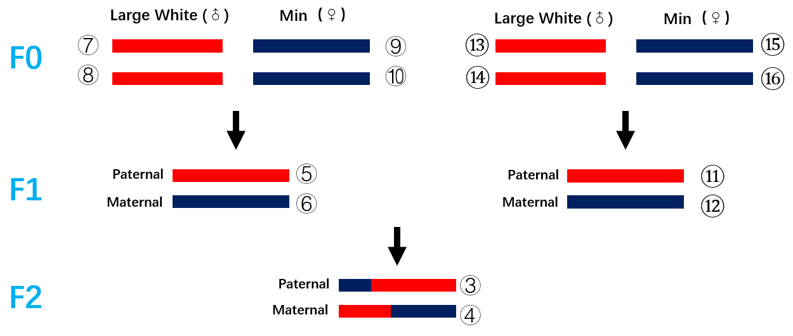
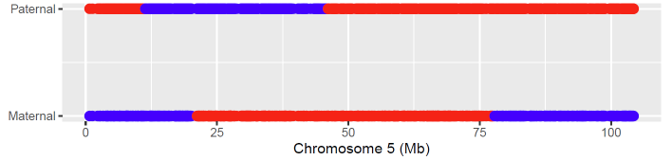

# Analysis of genetics underlying the hybrid effect variation in a Eurasian pig cross
Analysis carried out by Hai-Bing Xie (xiehb@mail.kiz.ac.cn), Zi-Qin Huang, Li-Gang Wang, and Long-Chao Zhang in consultation with Ya-Ping Zhang, Chung-I Wu and Li-Xian Wang.

# Overview

This provides the data and scripts to explore the genetics underlying hybrid effect variation in a F2 population of the pig (*Sus scrofa*). The F2 was developed from a cross between the European Large White (LW) boars and East Asian Min (MIN) sows.

## 1. The phenotypic data for the LW-MIN F2 population
All the F2 individuals were raised without any directional selection imposed by humans, and the phenotypes of the F2 are expected to vary with the segregation of the LW and MIN alleles in the F2 population. A total of 135 traits were collected in the F2 population, and most of them were collected at 240 days after birth. The raw phenotypic data was supplied in CSV format with a filename of “f2_trait_name_trait_value.csv”. The file contains five columns, indicating the sample id ("f2"), family id ("family"), an assigned number of a trait ("trait_id"), the abbreviation of the trait name ("trait_name"), and the phenotypic value of the trait ("trait_value"). The male sex is given with odd numbers of sample id and female sex with even numbers. The following shows an example of the intramuscular fat content (IMF) trait for a subset of the F2 samples.

```
f2	family	trait_id	trait_name	trait_value
1008001	10080	67	IMF	1.53
1008905	10089	67	IMF	1.87
1008902	10089	67	IMF	1.13
1008003	10080	67	IMF	3.13
932304	9323	67	IMF	1.4
932302	9323	67	IMF	2.47
932403	9324	67	IMF	2.81
932412	9324	67	IMF	2.9
931809	9318	67	IMF	2.16
932307	9323	67	IMF	6.31
```

## 2. Genotyping and phasing
For all the F0, F1, and F2, the genomes were determined using the Illumina SNP60 BeadChip. The genomic data is available in the file "sscrofa11.data.zip". The coordinates were shown in the genome build of Sscrofa 11.1.

We performed the haplotype inference for the whole LW-MIN family using the  shapeit software.

```
for i in `seq 1 18`
do
	shapeit -T 10 -P chr$i.ped chr$i.map --duohmm -W 15 --output-max chr$i.phased.duohmm --output-graph chr$i.phased.duohmm.graph --force
done
```

* [shapeit](https://mathgen.stats.ox.ac.uk/genetics_software/shapeit/shapeit.html) - Version : v2.r904


## 3. Transmission analysis and recombination breakpoint identification
We prepared a R script ("1.determination of recombination breakpoints and allelic transmission.R") to determine the genomic transmission from F1 to F2 and the inheritance of LW or MIN alleles in the paternal and maternal genomes of each F2. 

We applied several steps to determine the genomic transmission in the LW-MIN family. First, the phased data produced by the shapeit software were loaded into a dataframe in  the R. To reduce the computation complexity, the haplotype data of four grandparents and two parents for each F2 were extracted for analysis. Second, a combination of R functions *GetScore*, *StepHap*, and *correcting_haplotype* were developed to determine the genomic transmission across generations, especially from F1 to F2. In the LW-MIN family,  the F1 is always heterozygous (paternal/maternal as LW/MIN). In F1 males, the paternal chromosome (LW) was assigned with a number of *5*, and maternal chromosome (MIN) with a number of *6*. The numbers do not indiciate the chromosomes 5 and 6, but show the allele origin in the F0-F1-F2 transmission for each autosome. In F1 females, the paternal and maternal chromosomes were assigned to *11* and *12*. For the F2 offspring, the paternal and maternal chromosomes  were assigned *3* and *4*, respectively. Therefore, the *3* was identical to *5* or *6* if no recombination events was involved in the paternal genome, or a mosaic chromosome with both *5* and *6*. A similar case is for *4* represented by the *11* and *12*.  The following figure shows the naming convention.




The  *5*, *6*, *11*, and *12* were designed to indicate the inheritance of LW (odd number) or MIN (even number) alleles in the paternal and maternal genomes of the F2. The recombination events were determined by finding a boundary haborbing allele changes, for example from *5* to *6* on the paternal chromosome with an assigned number *3*. 

For details, please see the implementation of the three R functions.

The genomic transmission for all SNPs were generated in the f2.inheritance.txt file with the following format:
```
f2	chromosome	position	paternal_allele	maternal_allele
1007207	2	137601377	5	11
1007207	2	137609824	5	11
1007207	2	137650460	5	11
1007207	2	137892857	5	11
1007207	2	137978735	5	12
1007207	2	138011068	5	12
1007207	2	138014980	5	12
1007207	2	138048646	5	12
1007207	2	138066066	5	12
1007207	2	138137424	5	12
```
There is a recombination event detected in the maternal chromosome 2 of the F2 (id 1007207) between two SNPs (coordinates:137892857 and 137978735). The fifth and sixth columns indicates the F0 alleles in the F2 genomes as described above (*5*: LW allele, *11*: LW allele, and *12*: MIN allele). 

The following figure shows the inheritance of alleles on chromosome 5 in a F2 individual (930806). The red and blue colors indicate the LW and MIN alleles, respectively. The recombination breakpoints are indicated by the boundary SNPs at red-blue color shift  in the paternal and maternal genomes.



To reduce the complexity in the following analysis on hybrid effects, the f2.inheritance.txt was saved to a MySQL server, all the subsequent analysis was based on the saved tables.

## 4. Hybrid effect analysis
The hybrid effect is defined as the phenotypic difference between the homozygous (LW/LW or MIN/MIN) and heterozygous (LW/MIN or MIN/LW) genotypes in the LW-MIN F2 population. For each 100-kb window, four homozygote-heterozygote combinations (LW/LW-LW/MIN, LW/LW-MIN/LW, MIN/MIN-LW/MIN, and MIN/MIN-MIN/LW) were included. For all the 135 traits, the calcualted homozygote-heterozygote difference was scaled to the phenotypic mean of each sex, which makes the hybrid effects comparable across different traits.


## 5. Female heterozygote deficiency
The whole genome resequencing data was deposited in the Genome Sequence Archive (GSA; http://gsa.big.ac.cn) under accession number CRA002451. The lists for F2 males and F2 females are provided in the text files "F2male.txt" and "F2female.txt".

The comparison between male and female heterozygote frequencies is used to reveal the selection in each sex. The analysis is based on the whole genome resequencing data. The SNPs were grouped by the minior allele frequency (MAF) with a bin size of 0.05. For each group, the number of heterozogytes and homozygotes were compared between the sexes. 

The analysis was conducted using a C program (xie_unphased_vcf_for_heterozygote_stat.cpp):
```
vcftools --gzvcf F2.biallelic.chr.vcf.gz --min-alleles 2 --max-alleles 2 --exclude-positions excluded.snps.list --recode --stdout | xie_unphased_vcf_for_heterozygote_stat 100000 4 15 F2male.txt F2female.txt > F2.4to15X.100k.exclude.snps.allelefreq.stat.out
```
Here, the 100000 is the size of sliding windows, 4 and 15 are the thresholds of minimum and maximum sequencing depths for SNP sites, and the F2male.txt and F2female.txt are files providing the sample lists of F2 males and F2 females. The "F2.biallelic.chr.vcf.gz" is the VCF file for the LW-MIN family. The "excluded.snps.list" is a list of SNPs that are excluded in the analysis due to the tendency of mapping errors from paralogous genomic sequences.

The results is provided in the "F2.4to15X.100k.exclude.snps.allelefreq.stat.out" file. The format is given as below:
```
Chr     Position        Pop1size        Pop2size        SNPs    HomoSites1      HetSites1       HomoSites2      HetSites2       HetRatio1       HetRatio2
```
The Chr and Position indicate a 100-kb sliding window with a given lower boundary (0-based), the Pop1size (from F1male.txt) and Pop2size (from F2female.txt) are the sizes of samples with genomic data covering this window. SNPs is the total number of SNPs in this window with 0 < MAF < 0.05. HomoSites1 and HetSites1 are the total number of homozygotes and heterozygotes counted in the samples in F2male.txt, and HomoSites1 and HetSites1 provide information in samples from F2female.txt. HetRatio1 and HetRatio2 are the ratio of heterozygotes in the F2 males and females in a window. The seven columns (from SNPs to HetRatio2) replicate 10 times to indicate the results on SNPs with different MAFs (a step size of 0.05).


